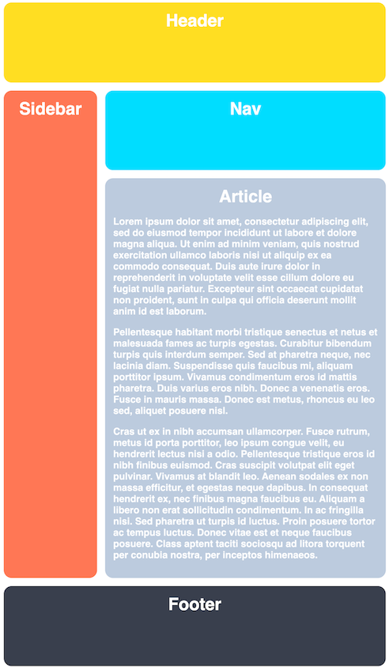

# Grid
 Grid-practice exercise
## Grid layout ex1 Desired Outcome

### Grid layout ex2 Desired Outcome

When the browser is narrow:

When the browser is stretched wide:

### Grid layout ex3 Desired Outcome

If you use the tools in the Advanced Grid Properties lesson you should be able to get your article cards to automatically fit as the browser window is adjusted:

